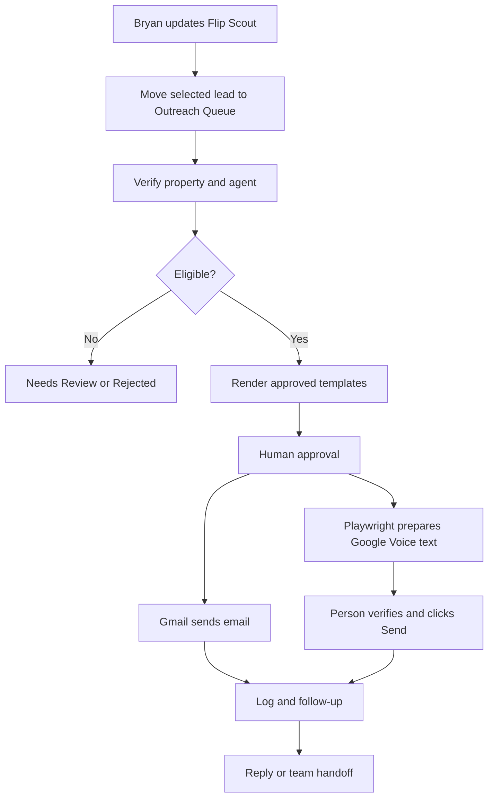

# Flip Scout Outreach Automation Plan

_This is the plan this repository was built from, kept for reference. See
`docs/ARCHITECTURE.md` for how the plan maps onto the actual code, and
`docs/OPEN_ITEMS.md` for what's still unresolved before activation._

### Goal

Build a separate outreach system that begins after Bryan adds or updates qualified properties in the existing `Flip Scout Leads` Google Sheet.

We will not modify Flip Scout's current scoring logic, automate Redfin navigation, or use REI BlackBook.

### Final workflow

## Responsibilities

| Person/system       | Responsibility                                                       |
| ------------------- | -------------------------------------------------------------------- |
| Bryan               | Navigate Redfin and maintain the existing Flip Scout Sheet           |
| Lawrence/team       | Verify listings, agents, contact information, and outreach readiness |
| Flip Scout          | Property sourcing, scoring, and deal information                    |
| Outreach system     | Templates, approvals, sending preparation, follow-ups, and reporting |
| Gmail               | Automatically send approved emails                                   |
| Playwright          | Open Google Voice, enter recipient, and prepare the approved SMS     |
| Human operator      | Verify Google Voice details and click Send                           |
| Juan/assigned owner | Handle positive replies and property discussions                     |

## Phase 1: Project foundation

Create a new GitHub repository specifically for this system.

Add these components:

* Google Apps Script
* Node.js
* Playwright
* GitHub source control
* Automated rule tests
* Environment-variable and secret handling

All live sending switches remain disabled initially.

## Phase 2: Google Sheet outreach layer

Keep `Flip Scout Leads` unchanged.

Add these tabs:

* `Outreach Queue`
* `Message Templates`
* `Communication Log`
* `Suppression List`
* `Settings`
* `Error Log`

Add a custom menu:

* Add selected Flip Scout rows
* Refresh validation
* Submit for approval
* Approve outreach
* Send approved emails

This avoids changing Bryan's current Flip Scout columns.

## Phase 3: Property verification

Before outreach, require:

* Listing status
* Days on market
* Occupancy
* Property condition
* Comparable-sales review
* Offer date
* Disclosure availability
* Agent name
* Agent phone
* Verified agent email, when available

### Qualification rules

A property must:

* Have 45 days on market or fewer
* Not be tenant occupied
* Need work
* Not already appear renovated
* Have the one-mile comp review completed
* Have verified agent contact information
* Not be a duplicate or suppressed contact

Missing information becomes `Needs Review`.

Confirmed disqualifiers become `Rejected`.

## Phase 4: Template system

Create version-controlled Twin Home Buyer templates for:

* Initial SMS
* SMS follow-up
* Final SMS
* Initial email
* Email follow-up
* Final email

Merge fields include:

* Agent first name
* Property address
* City
* Sender name
* Sender phone
* Sender email
* Handoff person
* Company website
* Verified years in business
* Verified Google review link

Templates must follow Juan's voice:

* Direct and practical
* Bay Area-specific
* Property-specific
* Respectful of the agent
* No exaggerated promises
* No fake urgency
* No guaranteed offer, price, commission, or closing timeline
* Relationship-building comes after discussing the current property

SMS messages will ask the agent to reply `YES` or `NO`.

* `YES` -> flag for follow-up or handoff
* `NO` -> stop the current outreach sequence
* Explicit opt-out requests -> set `Opted Out? = Yes` and suppress future outreach

## Phase 5: Eligibility and approval system

Status flow:

`Information Needed -> Ready for Drafting -> Pending Approval -> Approved -> Contacted -> Follow-Up Due -> Replied -> Handed Off`

Exception statuses:

* `Needs Review`
* `Duplicate`
* `Rejected`
* `Not Interested`
* `Opted Out`
* `Do Not Automate`
* `Failed Contact`

Human approval is required before the first email or text.

## Phase 6: Gmail automation

For approved leads with verified email addresses:

1. Confirm eligibility again.
2. Check the suppression list.
3. Confirm the rendered email has no missing fields.
4. Send through Gmail.
5. Record the exact subject and message.
6. Record recipient, sender, template version, and timestamp.
7. Update the outreach status.

Most outreach will be text-first because agent emails may not be available.

## Phase 7: Google Voice preparation

For approved SMS records:

1. Playwright opens Google Voice.
2. It selects the approved recipient.
3. It enters the exact approved text.
4. It verifies that the entered message matches the Sheet.
5. It stops before Send.
6. The operator checks the recipient and message.
7. The operator clicks Send.
8. The operator confirms the outcome.
9. The result is written back to Google Sheets.

The automation will never automatically click Google Voice's Send button.

## Phase 8: Duplicate and suppression controls

Use two identifiers:

* Contact key: normalized agent phone
* Outreach key: agent phone + property address + campaign

Stop outreach when:

* Agent replies
* Agent replies `NO`
* Agent opts out
* Lead is rejected
* Lead is handed off
* `Do Not Automate? = Yes`
* Contact appears on the suppression list

## Phase 9: Follow-ups and handoff

The system will:

* Schedule approved follow-ups
* Limit the sequence to two follow-ups
* Stop immediately after a response
* Notify the assigned person about positive replies
* Track handoff status
* Preserve the full communication history

## Phase 10: Testing and launch

Testing order:

1. Test validation without sending.
2. Test template rendering.
3. Test duplicate prevention.
4. Test suppression handling.
5. Test Gmail using an internal email.
6. Test Google Voice using an internal phone number.
7. Confirm logs and timestamps.
8. Pilot with a small approved batch.
9. Activate production only after team sign-off.

### Items to confirm before activation

* New GitHub repository URL
* Official sender name and Gmail
* Google Voice account/number
* Correct handoff person: Juan, Cherry, or another team member
* Verified years-in-business claim
* Official Google review link and review count
* Approved buyer-agent compensation wording
* Follow-up intervals
* Who is authorized to approve outreach

The first development milestone is the Sheet foundation, validation rules, template system, approval controls, duplicate protection, and logs -- with all live sending disabled.
